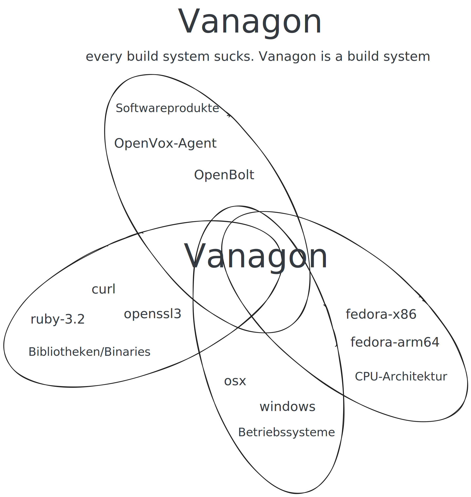
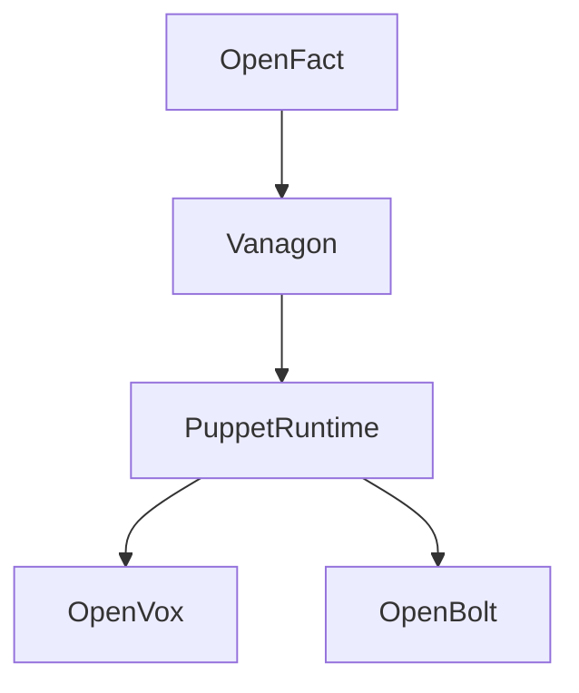
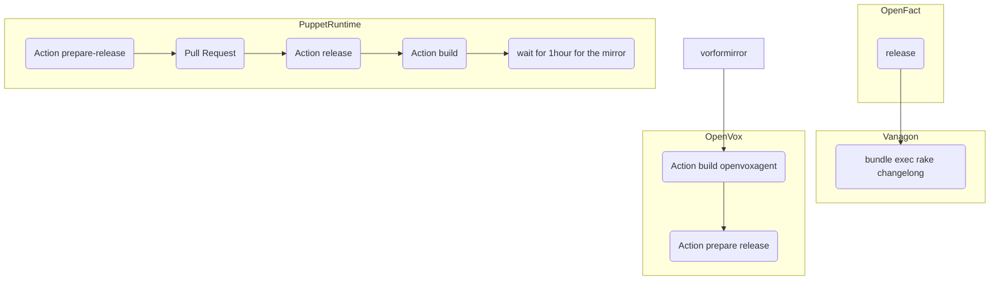

# Vanagon
2026-02-17

Every build system sucks. Vanagon is a build system.

## Management Summary

Vanagon can build OpenVox agent and OpenBolt. It builds for Windows, OSX, Debian-13-x86, Debian-13-arm64, Fedora... It introduces a lot of complexity to achieve those builds.

## High Level Overview

## Motivation

Let us assume you would like to build OpenVox agent. You want to support Windows, Debian-13 and Fedora-46.
Debian is very sloppy with Ruby updates. So we will ship our ruby version, updated at our peril.
We will compile ruby.
Windows uses mingw instead of gcc. It requires other compiler flags.
Debian supports x86 and arm64. Both architectures require other paths for libraries.
We want an up to date openssl, so we will ship that as well. And we want to make sure our ruby uses our openssl instead of system-openssl. We will introduce rpath (you rather not ask, but since you did - you can instruct the compiler to embed a directory path for libraries into the binary, so you can convince the loader not to use its standard paths) [1]

## Software Bill of Materials - SBOM

Vanagon produces a software bill of materials (SBOM), so you can fight with your companies compliance department that you are not using an outdatet openssl and your security scanner got it all wrong.

Example:

view-source:https://artifacts.voxpupuli.org/puppet-runtime/2026.02.16.1/agent-runtime-main-2026.02.16.1.windows-all-x64-bill-of-materials

    curl 8.18.0
    libffi 3.5.2
    libyaml 0.2.5
    openssl-3.0 3.0.19
    puppet-ca-bundle 1.1.0
    ruby-3.2 3.2.10
    rubygem-concurrent-ruby 1.3.6
    rubygem-deep_merge 1.2.2
    rubygem-erubi 1.13.1
    rubygem-fast_gettext 2.4.0
    rubygem-ffi 1.17.3
    rubygem-gettext 3.5.1
    rubygem-hiera-eyaml 4.3.0
    rubygem-highline 3.1.2
    rubygem-hocon 1.4.0
    rubygem-locale 2.1.4
    rubygem-minitar 1.1.0
    rubygem-multi_json 1.18.0
    rubygem-net-ssh 7.3.0
    rubygem-optimist 3.2.1
    rubygem-rexml 3.4.4
    rubygem-scanf 1.0.0
    rubygem-semantic_puppet 1.1.1
    rubygem-text 1.3.1
    rubygem-thor 1.5.0
    runtime-agent 

## shared resources
https://github.com/OpenVoxProject/puppet-runtime/blob/d5dc9a9c27b29c5b7c64c67c35b91b06c2202083/configs/projects/_shared-agent-settings.rb#L171

## Build Process

How do I build OpenVox agent?

Oh, that is quite simple. You just need to follow a few little steps:

(1) OpenFact - update OpenFact, release it
(2) Vanagon bundle exec rake changelog
(3) puppet-runtime Action prepare-release
(4) puppet-runtime Github.com-Pull-Request
(5) puppet-runtime Action release
(6) puppet-runtime Action build
(7) wait for an hour, that is the sync interval between SUSI and https://artifacts.voxpupuli.org/
(8) check your build on https://artifacts.voxpupuli.org/
(9) puppet-runtime-version eintragen in <unaussprechbar>.json
(10) openvox Action build openvox-agent
(11) openvox Action Prepare Release

## Sources and Further Reading

[1] How to user `rpath` https://www.cprogramming.com/tutorial/shared-libraries-linux-gcc.html
[2] sample software bill of materials (SBOM) https://artifacts.voxpupuli.org/puppet-runtime/2026.02.16.1/agent-runtime-main-2026.02.16.1.windows-all-x64-bill-of-materials

